# Lab 4 - Implantação automatizada

## Introdução

Esse workshop foi desenvolvido com o intuito de demonstrar as funcionalidades da Oracle Cloud Infrastructure em cenários onde se faz necessário construir uma esteira de desenvolvimento, com o serviço OCI DevOps, que irá automatizar a entrega de uma aplicação conteinerizada a um cluster Kubernetes!

*Tempo estimado para o Lab:* 30 Minutos

### **Pré requisitos**

Esse laboratório não requer pré-requisito.

### **Objetivos**
Nesse Workshop você vai:

- Conhecer o Oracle Container Engine for Kubernetes
O Oracle Cloud Infrastructure Container Engine for Kubernetes é um serviço totalmente gerenciado, escalável e altamente disponível que você pode usar para implantar seus aplicativos de contêineres na nuvem.

- Conhecer o serviço Oracle Cloud Infrastructure DevOps é uma plataforma completa de integração contínua/entrega contínua (CI/CD) para que os desenvolvedores simplifiquem e automatizem o ciclo de vida de desenvolvimento do software.

## Task 1: Preparar a Tenancy para o Oracle E-Business Suite

1. Efetuar login na Console da Oracle Cloud Infrastructure
Use as credenciais de administrador da tenancy para efetuar login na console do Oracle Cloud Infrastructure.

2. Registrar o Cloud Manager como uma aplicação confidencial na tenancy usando IAM com Identity Domains
Abra o menu de navegação e clique em Identity & Security. Em Identity, clique em Domain.
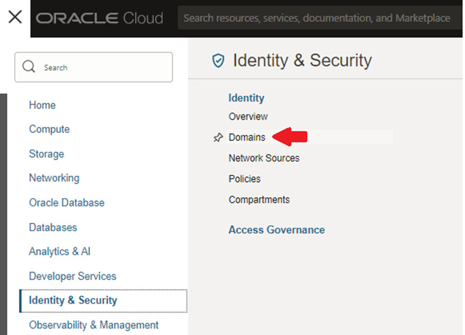

Selecione o root Compartment na lista suspensa Compartment. Na lista de Domains, clique no link do “Default” Domain.
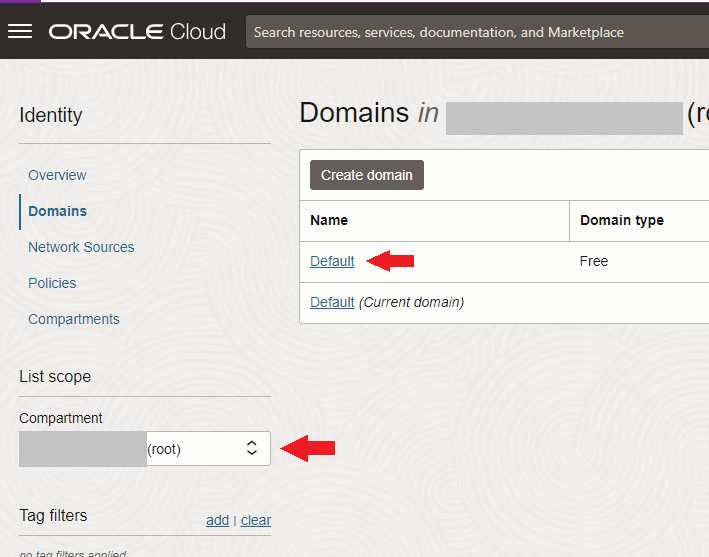
Clique em Integrated Applications no menu à esquerda.
Clique em Add application.
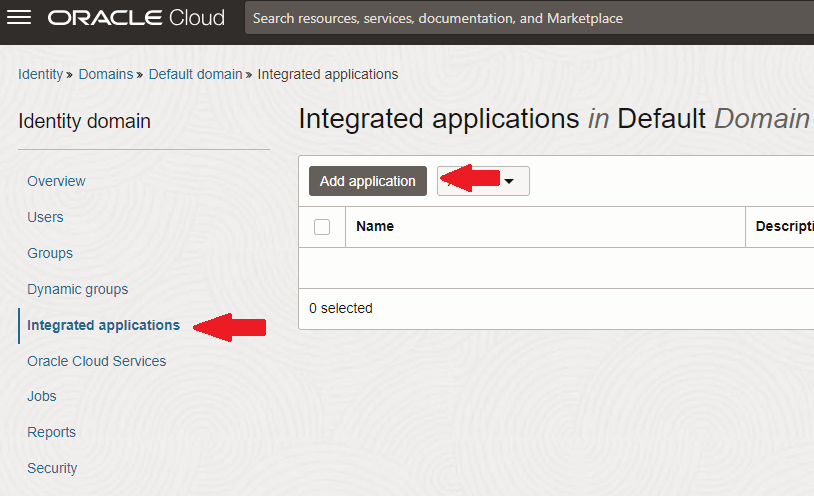
Selecione Confidential Application.
Clique em Launch Workflow. Isso leva você à página Add Confidential Application:
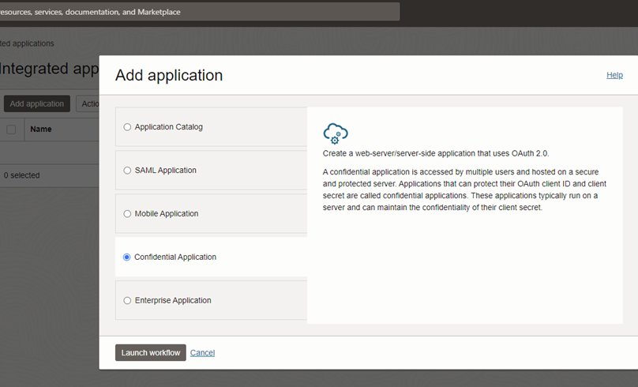

Em Add application details, insira o seguinte:

-	Name: Oracle E-Business Suite Cloud Manager
-	Description: Insira uma descrição.

Clique em Next.
Em Configure OAuth:
a. Clique em Configure this application as a client now.
b. Em Allowed Grant Types, selecione as seguintes opções:
-	Client Credentials
-	Refresh Token
-	Authorization Code

c. Agora, vamos definir nosso URL do Cloud Manager. Para este laboratório, use o seguinte URL de exemplo: https://myebscm.ebshol.org:443

Salve o URL do Cloud Manager em um arquivo key-data.txt como Cloud_Manager_URL para consulta posterior.
Usando o URL do Cloud Manager que você acabou de salvar, anexe a esse URL os seguintes valores, conforme mostrado, para inserir seu Redirect URL.

d. Redirect URL: <URL do Cloud Manager>/cm/auth/callback
Por exemplo: https://myebscm.ebshol.org:443/cm/auth/callback

e. Post-Logout Redirect URL: <URL do Load Balancer do Cloud Manager>/cm/ui/index.html?root=login
Por exemplo: https://myebscm.ebshol.org:443/cm/ui/index.html?root=login

f. Logout URL: deixe este campo vazio.
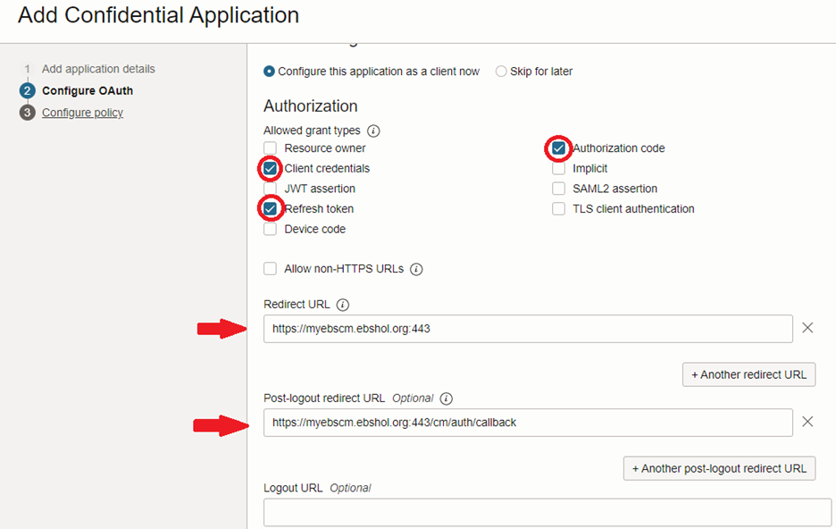

g. Em Client Type, certifique-se de que o botão de opção Confidential esteja selecionado.

h. Selecione a opção Introspect para Allowed Operations.

i. Em Token Issuance Policy, marque a caixa de seleção Add app roles. Clique em Add roles.
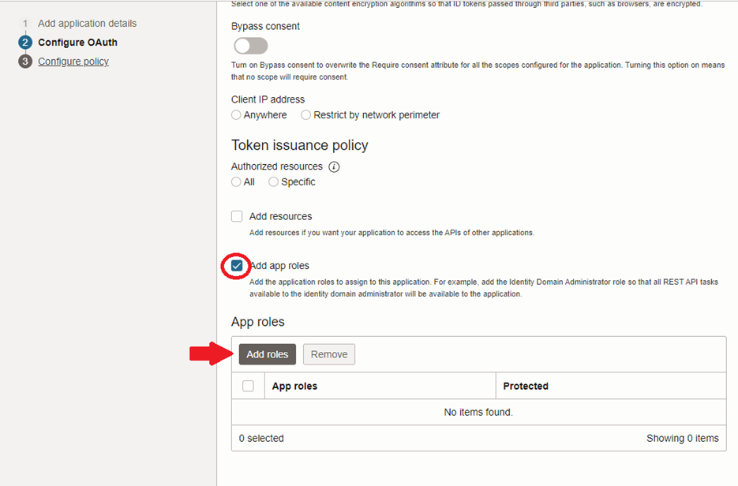

Selecione Authenticator Client e Me. Em seguida, clique em Add.
Clique em Next.
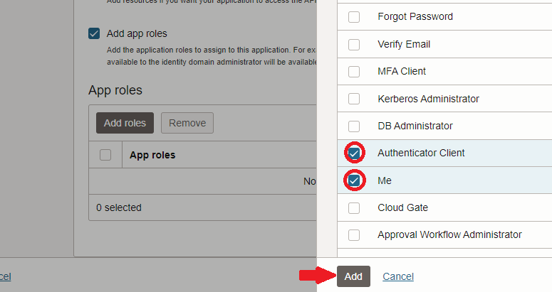
Em Configure policy, clique em Finish.
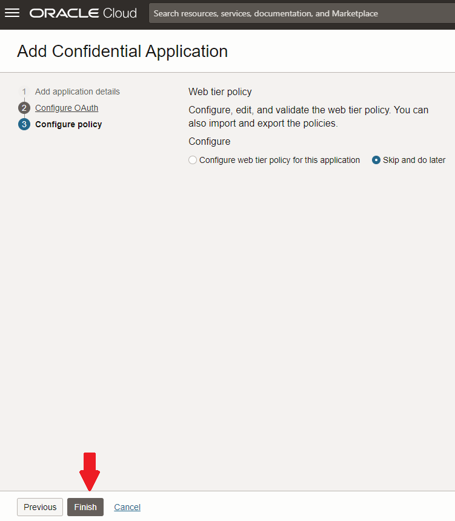
Anote os seguintes valores em seu key-data.txt (Client_ID e Client_Secret, respectivamente):

- ID do Cliente
- Client Secret (para visualizar, clique em Show secret.)

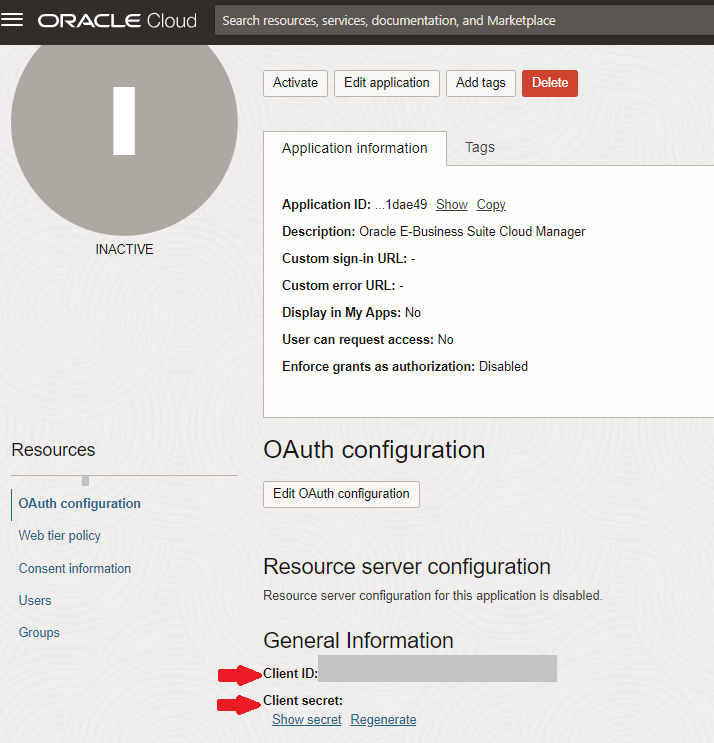
Clique em Activate e confirme para ativar a aplicação confidencial.

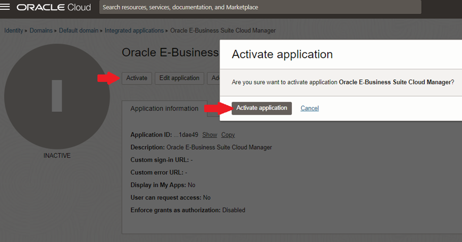
Registre o valor do Oracle Identity Cloud Service Client Tenant como Client_Tenant no key-data.txt. Isso é encontrado no Overview do Default Domain na seção Domain Information. É visto como parte da URL encontrada na URL do domínio, após "//" e antes de ".identity.oraclecloud.com". Começa com os caracteres "idcs-", seguidos por uma sequência de números e letras no formato idcs-xxxxxxxxxxxxxxxxxxxxxxxxxxxxxxxxx.
Por exemplo: idcs-6572bfeb183b4becad9e649bfa14a488.

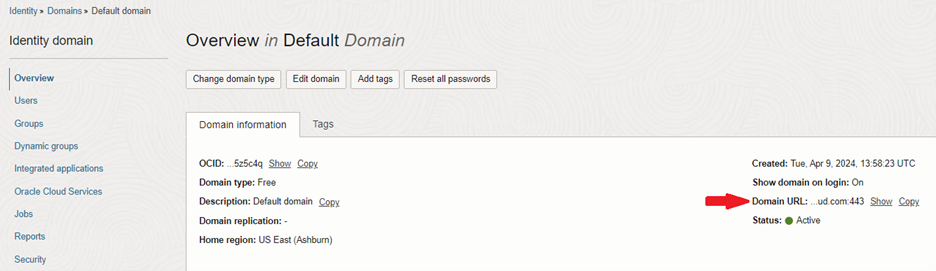

## Task 2: C- Implantação e configuração do Oracle E-Business Suite Cloud Manager

No menu de navegação da console do OCI clique em Marketplace e selecione All Aplications. 
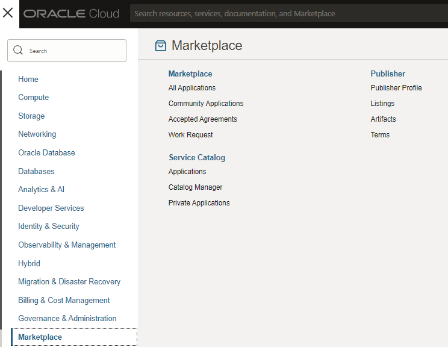

Na página de aplicações do Marketplace:
•	Navegue até Filter e em seguida selecione Stack.
•	Na barra de pesquisa, digite "E-Business Suite".
•	Clique na aplicação Oracle E-Business Suite Cloud Manager Stack for Demos.

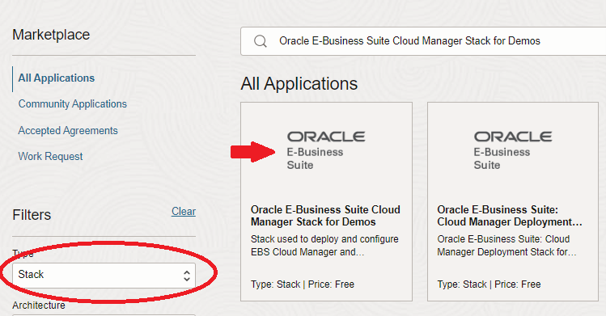
Certifique-se de que a versão padrão esteja selecionada.

Na lista Compartment, selecione o compartimento pai do compartimento onde a instância do Oracle E-Business Suite Cloud Manager Compute será implementada. Por exemplo, minhaempresatenancy(root).

Revise e aceite os Termos de Uso.

Clique em Launch Stack.

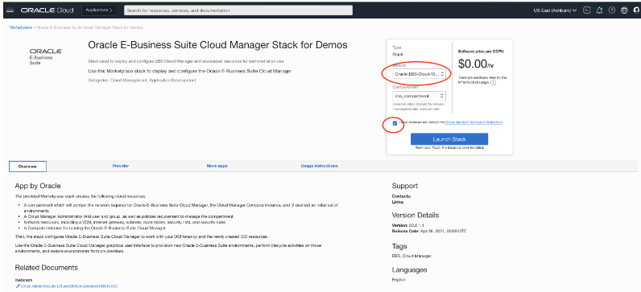

Na tela Stack Information insira os seguintes valores:
- Name: O padrão é Oracle E-Business Suite Cloud Manager Stack for Demos-<date&time>.
- Description: Adicione uma descrição para a stack.
As duas últimas variáveis devem conter:
- Compartment: É o compartimento selecionado previamente
- Terraform Version: selecione 0.12.x na lista. 
Clique em Next.
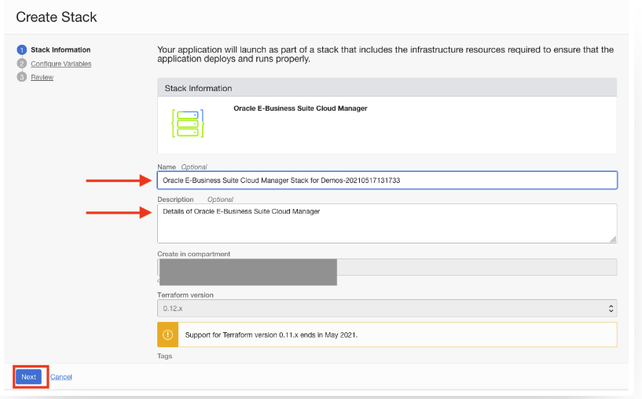

Na tela Configure Variables insira os seguintes valores:
- Resource Prefix: ebshol
- Single Compartment Setup: Certifique-se de que essa opção esteja selecionada.
- Parent Compartment: Selecione seu compartimento como compartimento pai para seus recursos.
- EBS Cloud Manager Administrator Username: ebscm.admin@example.com
- EBS Cloud Manager Administrator Email: Este pode ser uma conta de e-mail pessoal.
- Criar New REST API KEY: certifique-se de que esta caixa de seleção esteja marcada.

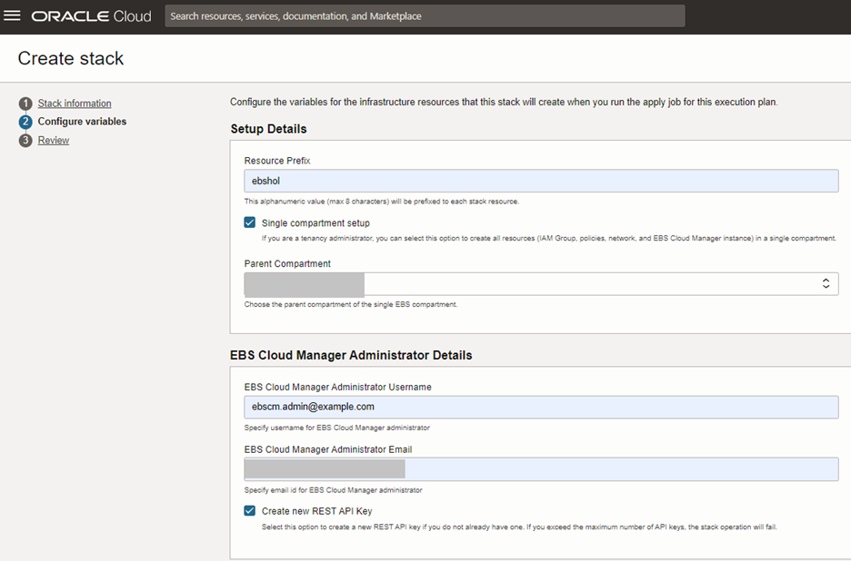

Server Host for EBS Cloud Manager Login URL: myebscm.ebshol.org
- EBS Cloud Manager Shape: VM.Standard.E2.2
- EBS Cloud Manager Admin Password:
- Essa senha é o que permitirá que você faça login na instância do Cloud Manager e PODE ser diferente da senha do usuário para efetuar login na Console do OCI.

Adicione esta senha ao seu arquivo key-data.txt.
- Public Key: Use uma chave ssh existente ou gere uma nova. Cole a chave pública.
Para obter mais informações sobre chaves ssh, visite: Gerando um par de chaves SSH (https://www.oracle.com/webfolder/technetwork/tutorials/obe/cloud/compute-iaas/generating_ssh_key/generate_ssh_key.html)
- EBS Cloud Manager Availability Domain: Escolha o domínio de disponibilidade que termina em -1 na lista. 
- Para regiões que só possuem um domínio de disponibilidade não é necessário escolher.

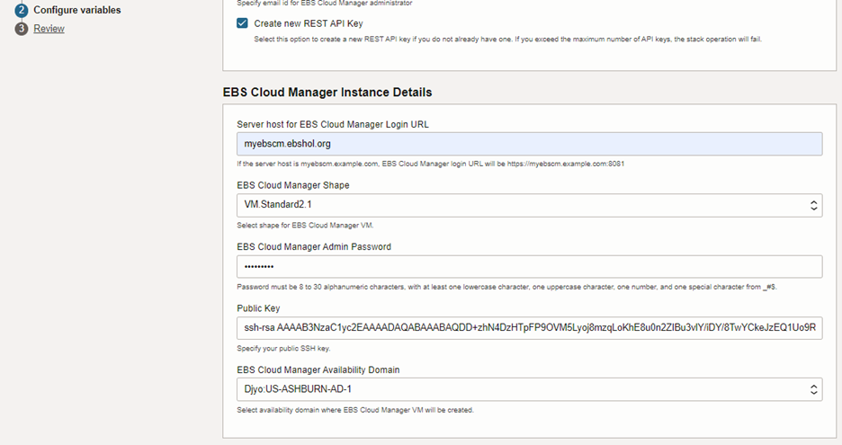
- Custom CIDR Ranges: Deixe esta caixa de seleção desmarcada.
- EBS Cloud Manager Access CIDR: 0.0.0.0/0

Insira os valores do arquivo key-data.txt da seguinte forma:
1-	IDCS Client ID:  Client_ID
2-	IDCS Client Secret: Client_Secret
3-	IDCS Client Tenant: Client_Tenant
Click Next.

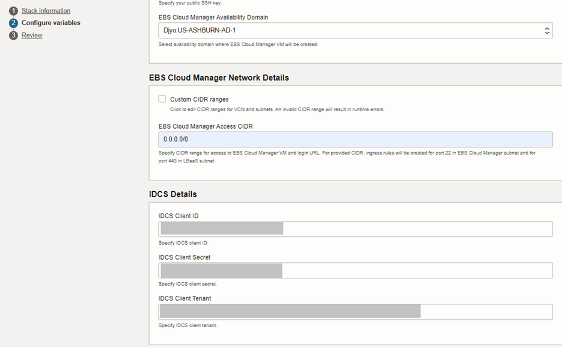

Na tela Review Information, verifique as informações e clique em Create.

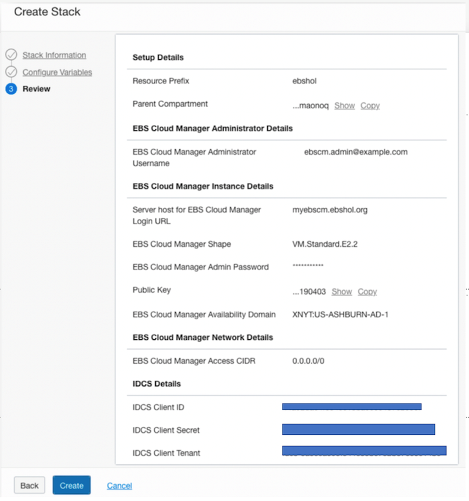
Isso leva você à página Stack Details da stack recém-criada. Você notará que o status do trabalho passará por Accepted, In progress e Succeeded. Isso levará algum tempo para ser concluído.

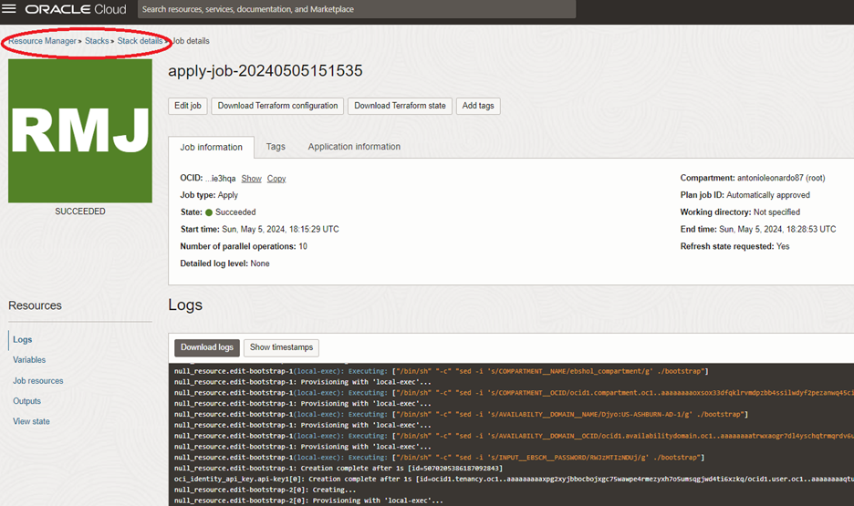

Depois que o job for bem-sucedido, você terá todos os recursos de rede (VCN, Load Balancer, subnets e assim por diante) necessários para implantar a instância do Oracle E-Business Suite Cloud Manager.

Você encontrará os detalhes relacionados à instância do EBS Cloud Manager e ao Load Balancer na parte inferior da saída de log (Outputs), conforme mostrado na captura de tela a seguir:

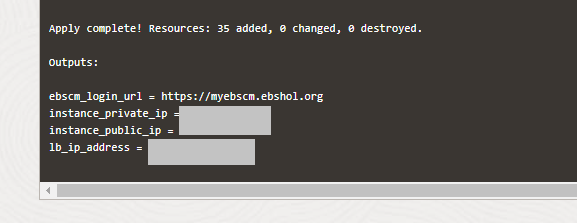

Copie e cole IP privado, IP público, URL de login e IP público do Load Balancer em seu arquivo key-data.txt. Essas variáveis são necessárias para o restante dos procedimentos deste laboratório.

## Task 3: Logar no Oracle E-Business Suite Cloud Manager.

Antes de fazer login na página web do EBS Cloud Manager, você precisa adicionar hostname ao arquivo de hosts do seu computador local. Siga as instruções abaixo para realizar esta configuração:
a-	Edite o arquivo Local Hosts em seu computador e adicione uma entrada.

b-	Para Windows:
- Navegue até o Bloco de Notas no menu Iniciar.
- Passe o mouse sobre o Bloco de notas, clique com o botão direito e selecione a opção Executar como administrador.
- No Bloco de Notas, navegue até Arquivo > Abrir.
- Navegue até C:\\Windows\System32\drivers\etc.
- Encontre o arquivo "hosts".
- No arquivo hosts, role para baixo até o final do conteúdo.
- Adicione a seguinte entrada bem no final do arquivo: <lb_public_ip> myebscm.ebshol.org
- Salve o arquivo.

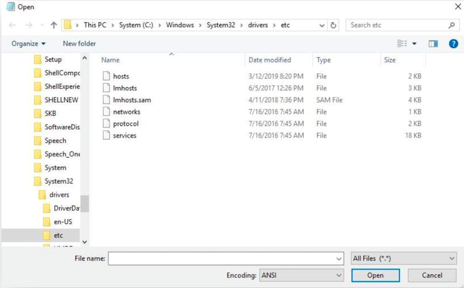

Digite o URL de login gerado e documentado em seu key-data.txt anteriormente no seu navegador.

Faça login no Oracle E-Business Suite Cloud Manager usando suas credenciais IDCS para a conta do EBS Cloud Manager, conforme documentado em seu arquivo key-data.txt.

Observação: pode levar algum tempo adicional para que o balanceador de carga seja configurado corretamente. Às vezes, a configuração pode levar até 30 minutos ou uma hora. Se você quiser verificar o status do balanceador de carga, na console do OCI vá para Networking > Load Balancers e verifique o status geral do Heatlh. Se estiver tudo bem, a conexão pode ser estabelecida.
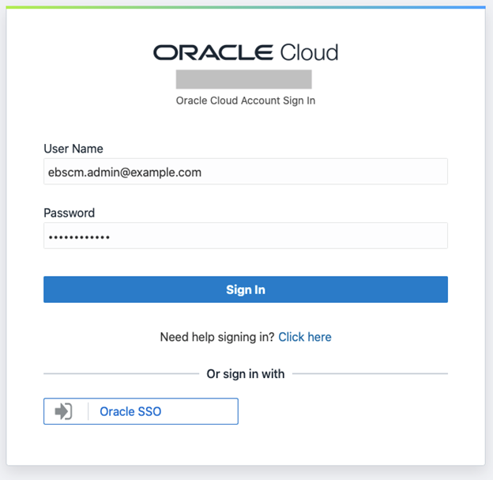

Uma vez logado, você estará na Environments page.

## Conclusão

### Parabéns!!!👏🏻 Laboratório concluído. Você pode continuar executando outros laboratórios relacionados ao tema na página : Lift and Shift On-Premises EBS to OCI (https://apexapps.oracle.com/pls/apex/r/dbpm/livelabs/run-workshop?p210_wid=672&p210_wec=&session=14855038387887).

## Autoria

- **Autores** - Andressa Siqueira
- **Último Update Por/Date** - Andressa Siqueira Maio/2024
